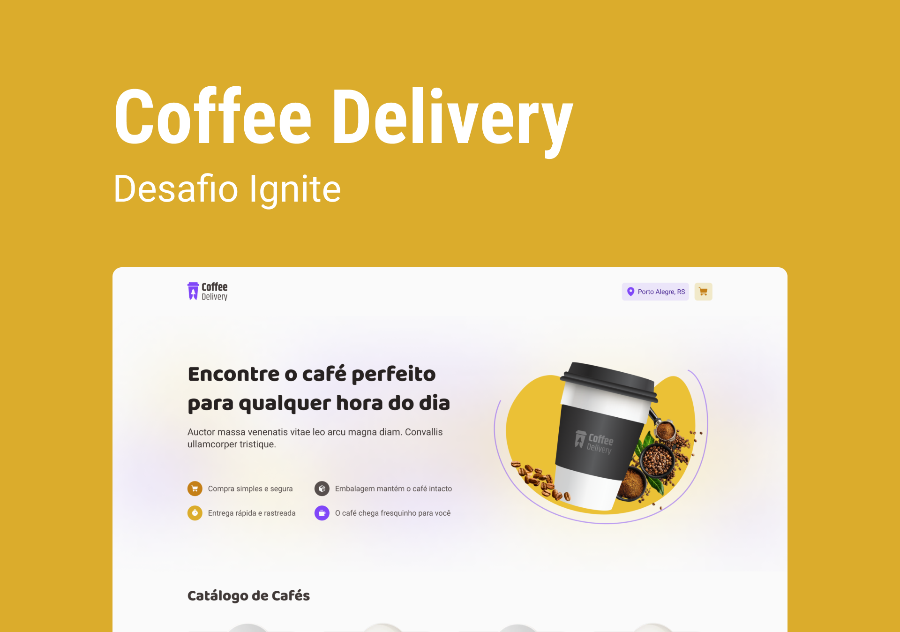

<h1 align="center">
    
</h1>
<p align="center">
-
</p>

<p align="center">
 <a href="#sobre-o-projeto">Sobre o Projeto</a> |
 <a href="#tecnologias">Tecnologias</a> |
 <a href="#iniciando-o-projeto">Iniciando o projeto</a> |
 <a href="#licença">Licença</a> |
 <a href="#autor">Autor</a>
</p>

### 🎉 Sobre o projeto

Que tal receber no aconchego da sua casa um café quentinho e com aquele sabor direto da fazenda?

Coffee Delivery é uma aplicação de encomendas/delivery de cafés, desenvolvida do zero utilizando ReactJS utilizando Vite e TypeScript.

A aplicação possui 3 telas, sendo:

A primeira, uma tela de apresentação do cafeteria e um cardápio com diversas opções onde o cliente pode escolher os sabores e as quntidades.
A segunda, onde o cliente insere os dados do endereço de entrega, forma de pagamento e pode visualizar e alterar o carrinho de compras.
A terceira, onde a compra é confirmada exibindo dados inseridos no passo anterior.

---

### 🛠️ Tecnologias

- [ReactJs](https://reactjs.org/)
- [Typescript](https://www.typescriptlang.org/)
- [Phosphor Icons](https://phosphoricons.com/)
- [Styled Components](https://styled-components.com/)
- [ViteJS](https://vitejs.dev/)
- [LocalStorage API](https://developer.mozilla.org/pt-BR/docs/Web/API/Window/localStorage)
- [Immer](https://immerjs.github.io/immer/)
- [AutoAnimate](https://auto-animate.formkit.com/)
- [React Toastify](https://www.npmjs.com/package/react-toastify)
- [React Router](https://reactrouter.com/en/main)
- [ViaCEP API](https://viacep.com.br/)

### 🚀 Iniciando o projeto

```bash
# Clonar aplicação

$ git clone https://github.com/MauricioAires/coffee-delivery-airs

# Acessar a aplicação
$ cd coffee-delivery-airs

# Execute yarn para instalar as dependências
$ npm i

# Para iniciar a aplicação
$ npm dev

```

---

### 📝 Licença

Distribuído sob a licença MIT.
Veja [LICENSE](LICENSE) para mais informações.

---

### 👨‍💻 Autor

Feito por Mauricio Aires 👋🏽
